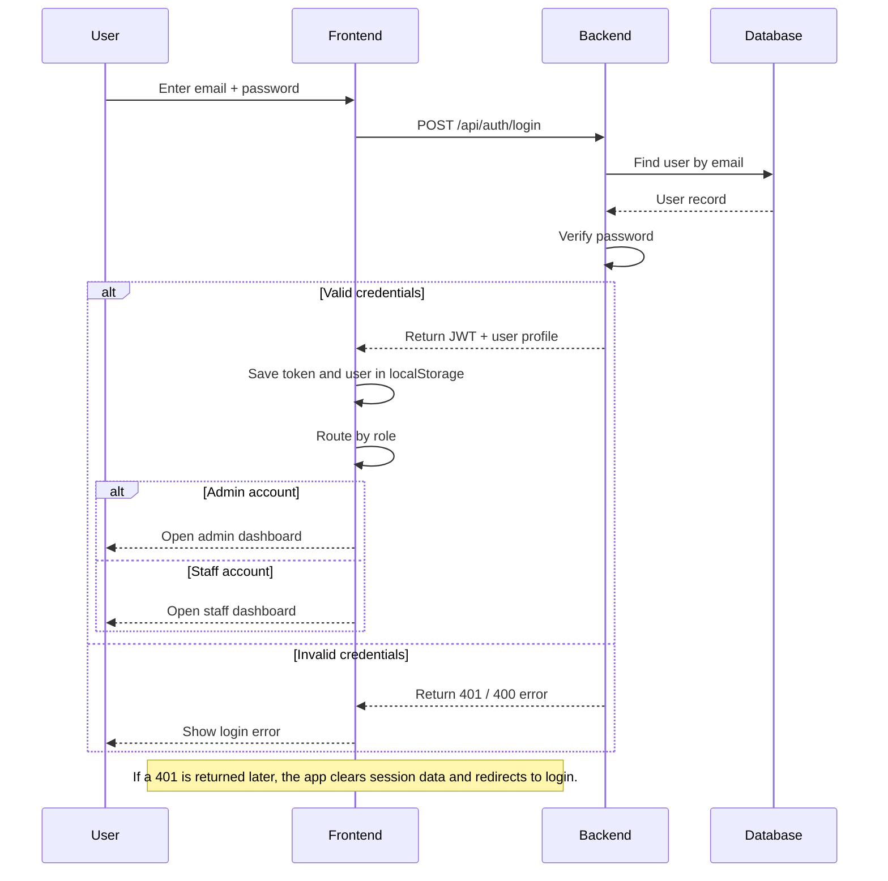
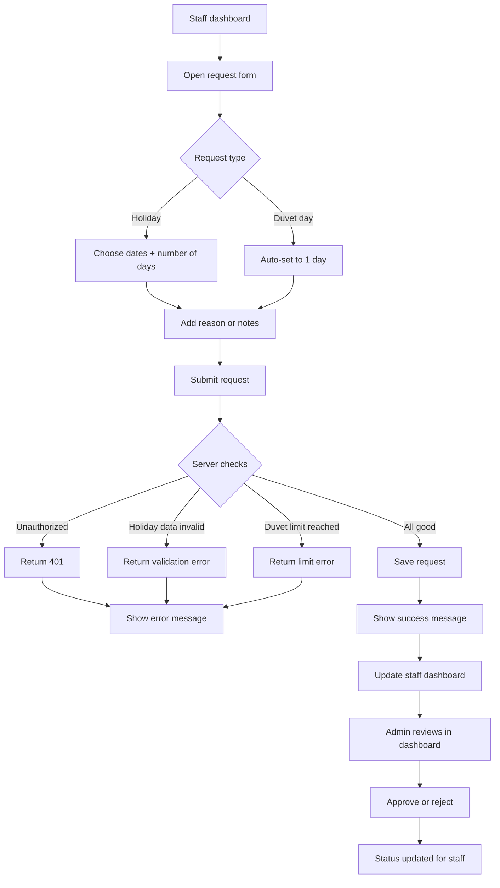
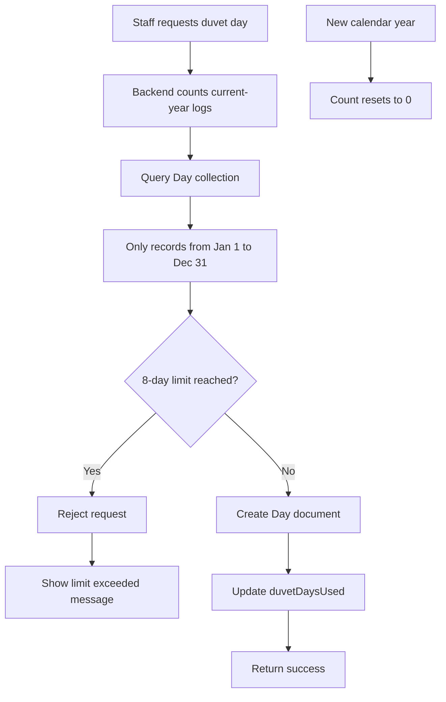
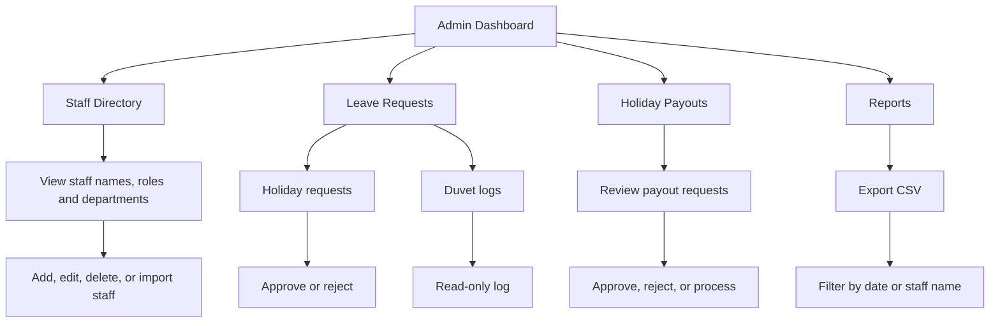
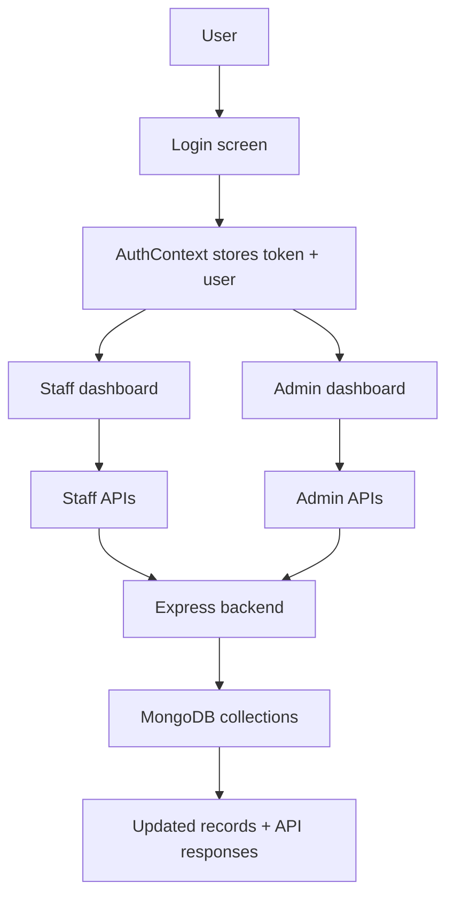

# HolidaysDB - Holiday & Leave Management System

A comprehensive leave and holiday management system with duvet-day tracking, admin controls, and real-time dashboard updates.

---

## Table of Contents

- [Overview](#overview)
- [Key Features](#key-features)
- [Tech Stack](#tech-stack)
- [Application Flow](#application-flow)
- [Setup Instructions](#setup-instructions)
- [Running the Application](#running-the-application)
- [Project Structure](#project-structure)
- [API Endpoints](#api-endpoints)
- [Important Notes](#important-notes)

---

## Overview

**HolidaysDB** is a full-stack web application designed to streamline holiday and leave management for organizations. It allows:

- **Staff** to request holidays and log duvet days (with yearly limits)
- **Admins** to approve/reject requests, view comprehensive reports, and export payroll data
- **Real-time tracking** of leave balances and duvet-day usage

### Key Innovation: Duvet Day Yearly Limit
- **Hard limit: 8 duvet days per calendar year** (enforced server-side)
- Staff cannot exceed this limit
- Usage resets on January 1st annually
- Admin can view all duvet logs with staff names and dates

---

## Key Features

### For Staff
- **Dashboard** with leave balance and duvet days remaining
- **Request Leave** - submit holiday or duvet-day requests
- **Duvet Day Logging** - log duvet days (1-day increments, max 8/year)
- **Holiday Payout** - apply for holiday payouts
- **View Requests** - track submitted requests and their status

### For Admins
- **Admin Dashboard** - overview of all staff and requests
- **Approve/Reject Requests** - manage leave and duvet-day requests
- **Duvet Logs** - view all duvet days logged with staff names and dates
- **Staff Statistics** - see duvet days used/remaining for each staff member
- **Payroll Export** - export data to CSV for payroll processing
- **Staff Management** - add, edit, and manage staff records

### Security
- **JWT Authentication** - secure token-based authentication
- **Role-based Access** - staff vs. admin views
- **Automatic Session Expiry** - 401 handling with auto-logout
- **Environment Variables** - sensitive data (DB credentials, JWT secret) protected

---

## Tech Stack

### Backend
- **Runtime:** Node.js
- **Framework:** Express.js
- **Database:** MongoDB (Mongoose ODM)
- **Authentication:** JWT (jsonwebtoken)
- **Additional:** cors, dotenv, multer, bcryptjs, csv-writer

### Frontend
- **Framework:** React 18
- **Build Tool:** Vite
- **Styling:** CSS
- **HTTP Client:** Fetch API
- **State Management:** Context API (AuthContext)

### Development
- **Backend Dev Server:** Nodemon
- **Package Manager:** npm

---

## Application Flow

### **1. Authentication Flow**



---

### **2. Staff Leave Request Flow**



---

### **3. Duvet Day Yearly Limit Enforcement**



---

### **4. Admin Dashboard Flow**



---

### **5. System Data Flow**



---

## Setup Instructions

### Prerequisites
- **Node.js** (v14+)
- **MongoDB** (local or Atlas)
- **npm** or **yarn**

### 1. Clone Repository
```bash
git clone <repository-url>
cd holidaysdb
```

### 2. Backend Setup

```bash
cd backend

# Install dependencies
npm install

# Create .env file
cat > .env << EOF
MONGO_URI=mongodb://localhost:27017/holidaysdb
JWT_SECRET=your_jwt_secret_here
PORT=5000
EOF

# Ensure MongoDB is running
# On Windows (if MongoDB installed locally):
#   mongod
# Or use MongoDB Atlas (update MONGO_URI in .env)
```

### 3. Frontend Setup

```bash
cd ../frontend/attendx

# Install dependencies
npm install

# Create .env file
cat > .env << EOF
VITE_API_URL=http://localhost:5000
EOF
```

---

## Running the Application

### Start Backend

```bash
cd backend
npm run dev
```

**Expected output:**
```
MongoDB Connected
Server running on port 5000
```

### Start Frontend

In a new terminal:

```bash
cd frontend/attendx
npm run dev
```

**Expected output:**
```
VITE v4.x.x  ready in xxx ms

➜  Local:   http://localhost:5173/
```

### Access the Application

- **Frontend:** http://localhost:5173
- **Backend API:** http://localhost:5000

---

## Project Structure

```
holidaysdb/
├── backend/
│   ├── controllers/
│   │   ├── authController.js       # Login/register logic
│   │   ├── staffControlller.js     # Staff duvet & profile endpoints
│   │   └── adminController.js      # Admin requests & exports
│   ├── middleware/
│   │   ├── auth.js                 # JWT verification middleware
│   │   └── upload.js               # File upload handling
│   ├── models/
│   │   ├── User.js                 # User schema (staff/admin)
│   │   ├── Day.js                  # Duvet day log schema
│   │   ├── HolidayRequest.js       # Holiday request schema
│   │   ├── HolidayPayout.js        # Payout request schema
│   │   └── StaffLeave.js           # (Legacy) leave schema
│   ├── routes/
│   │   ├── authRoutes.js           # Auth endpoints
│   │   ├── staffRoutes.js          # Staff endpoints
│   │   └── adminRoutes.js          # Admin endpoints
│   ├── .env                        # Environment variables (not committed)
│   ├── package.json                # Dependencies
│   └── server.js                   # Express server entry point
│
├── frontend/
│   └── attendx/
│       ├── src/
│       │   ├── context/
│       │   │   └── AuthContext.jsx # Global auth state + API calls
│       │   ├── hooks/
│       │   │   └── useAuth.js      # Custom auth hook
│       │   ├── pages/
│       │   │   ├── Login.jsx       # Staff/admin login page
│       │   │   ├── AdminLogin.jsx  # (Alternative) admin login
│       │   │   ├── StaffDashboard.jsx    # Staff dashboard
│       │   │   ├── AdminDashboard.jsx    # Admin dashboard
│       │   │   ├── HolidayRequest.jsx    # Holiday payout form
│       │   │   └── (other pages)
│       │   ├── App.jsx             # Main app component
│       │   ├── main.jsx            # React entry point
│       │   └── index.css           # Global styles
│       ├── .env                    # Frontend env vars (not committed)
│       ├── package.json            # Dependencies
│       ├── vite.config.js          # Vite configuration
│       └── index.html              # HTML template
│
├── .gitignore                      # Ignore .env, node_modules, etc.
└── README.md                       # This file
```

---

## API Endpoints

### Authentication
- `POST /api/auth/login` - Login (staff/admin)
- `POST /api/auth/register` - Register new staff member
- `POST /api/auth/admin-register` - Register admin (admin only)

### Staff Endpoints
- `GET /api/staff/profile` - Get staff profile + duvet stats
- `POST /api/staff/duvet-day` - Log duvet day (enforces 8-day limit)
- `POST /api/staff/holiday-request` - Submit holiday request
- `GET /api/staff/requests` - Get staff's requests

### Admin Endpoints
- `GET /api/admin/all-staff` - List all staff with duvet stats
- `GET /api/admin/requests` - List all leave requests
- `PUT /api/admin/requests/:id` - Approve/reject request
- `GET /api/admin/duvet-logs` - Get all duvet logs (with staff names)
- `GET /api/admin/export-csv` - Export payroll data
- `POST /api/admin/staff` - Add new staff member
- `PUT /api/admin/staff/:id` - Edit staff member
- `DELETE /api/admin/staff/:id` - Remove staff member

---

## Important Notes

### 1. **Environment Variables**
- `.env` files are **NOT** committed to git (see `.gitignore`)
- Create `.env` locally in `backend/` and `frontend/attendx/`
- **Never commit secrets** (DB credentials, JWT secret)

### 2. **MongoDB Connection**
- **Local:** `mongodb://localhost:27017/holidaysdb`
- **Atlas (Cloud):** Use explicit host list URI to avoid SRV DNS issues
  ```
  mongodb://host1:27017,host2:27017,host3:27017/holidaysdb
  ```

### 3. **Duvet Day Limit**
- **Limit:** 8 duvet days per calendar year (Jan 1 - Dec 31)
- **Enforcement:** Server-side (backend counts `Day` documents)
- **Reset:** Automatic on January 1st (no manual action needed)
- **Edge Case:** If user tries to log duvet on Dec 31, it counts toward current year (not next year)

### 4. **JWT Token Handling**
- Token stored in `localStorage` as `attendx_token`
- Token automatically cleared on 401 (invalid/expired)
- User logged out and redirected to login page
- No manual "logout" needed for expired tokens

### 5. **Duvet Logs in Admin Dashboard**
- Duvet logs appear in "Leave Requests" tab
- Staff name populated via `.populate("userId", "name")` in `Day` model
- Marked with "Logged" badge (read-only, no approve/reject buttons)
- Mixed with regular holiday requests in same table

### 6. **Database Models**
- **User:** Staff/admin credentials + profile info + `duvetDaysUsed` (cache)
- **Day:** Duvet day logs with `userId` reference (not incremental counter)
- **HolidayRequest:** Leave requests (pending, approved, rejected)
- **HolidayPayout:** Payout requests for unused holidays

---

## Troubleshooting

### MongoDB Connection Error
```
MongoDB connection failed: The `uri` parameter to `openUri()` must be a string, got "undefined"
```
**Fix:** Ensure `.env` file exists in `backend/` with `MONGO_URI` defined.

### Frontend API Calls Fail (404/CORS)
```
CORS error or API not found
```
**Fix:** Verify `VITE_API_URL` in `frontend/.env` matches backend port (default: `http://localhost:5000`).

### Duvet Limit Not Enforced
**Fix:** Backend counts `Day` documents for the calendar year. Ensure:
1. MongoDB is connected
2. Duvet day was saved to `Day` collection
3. Query filters by current year (`createdAt` field)

### Session Expires Unexpectedly
**Fix:** Check JWT expiry time in backend auth controller. Increase token lifetime if needed.

---

## License

[Your License Here]

---

**Last Updated:** May 2026  
**Version:** 1.0.0  
**Status:** Production-Ready
